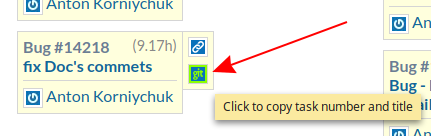
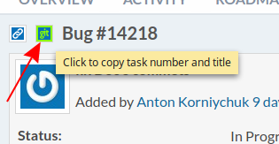
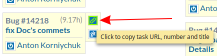
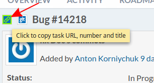

# Unicsoft Redmine Helper(Chrome plugin)
Adds some features to unicsoft's redmine

Just download and install: [unicsoft-redmine-helper.crx](https://github.com/ancor-dev/unicsoft-redmine-helper/raw/master/dist/unicsoft-redmine-helper.crx)

### Features

- Adds icon to copy task number & title to clipboard  
    
  

- Adds icon to copy task URL, number and title and to clipboard  
    
  
